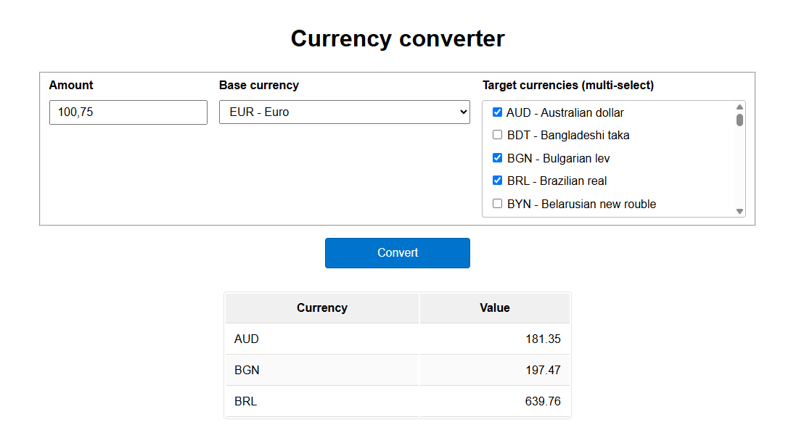
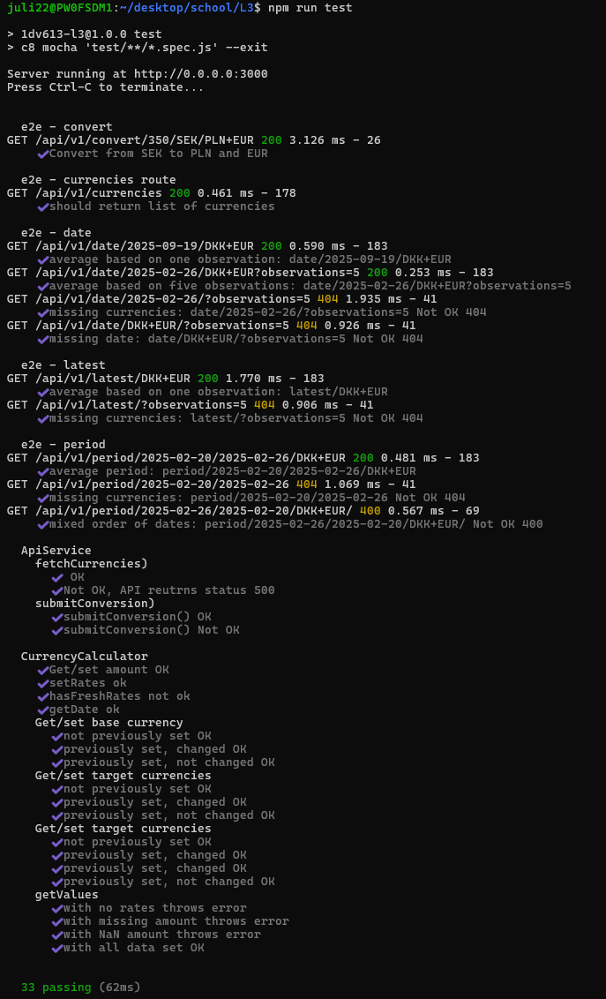
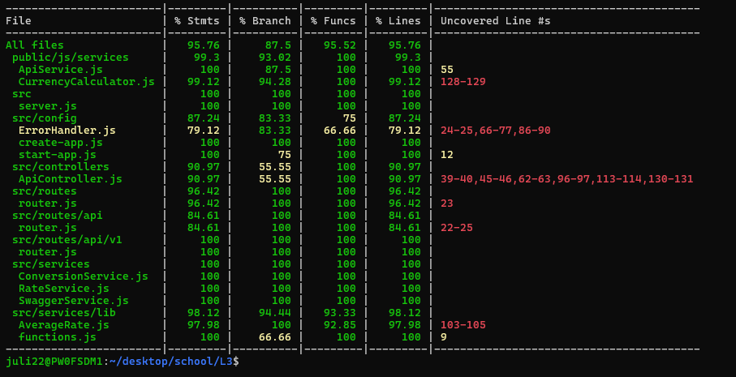
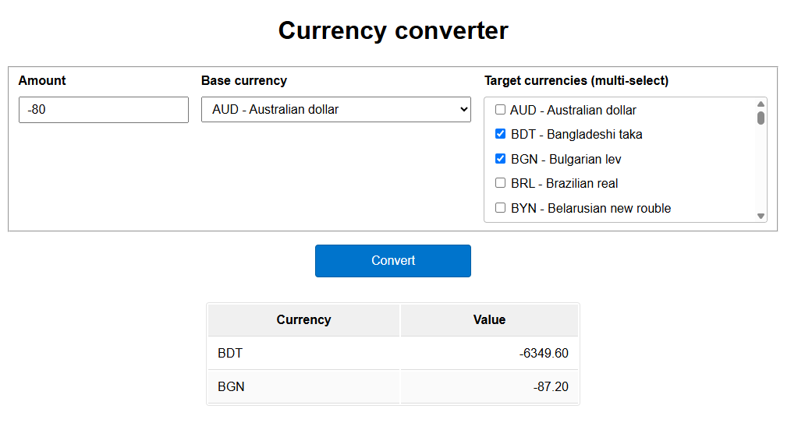

# 1DV610-L3 Currency convert + Norway bank api adapter restAPI

## About

This is a school project that is deployed at https://julia-lnu.duckdns.org/exr/ .  

### RestAPI  

The API https://julia-lnu.duckdns.org/exr/api/v1/ provides various endpoints that return average currencies based on passed parameters. The endpoints with usage examples are desribed with Swagger at https://julia-lnu.duckdns.org/exr/api/swagger.  

### Single-page web-application

A single page application, with a GUI for converting an amount from base currency to target currencies, is available at root https://julia-lnu.duckdns.org/exr/.  

  


## Testing

The API endpoints, and the service-classes used by webapp have been e2e tested with a coverage of above 90% measured with c8. Latest test report available under https://github.com/JuliaLind/1DV610-L3/actions/workflows/ci.yml  and also in the separate file in Swedish testrapport.md.  

  
  

The app is deployed via Guthub actions - both Lint and Test steps are required to pass in order fot he Deploy step to execute.   

The webapp gui is tested manually (ref screenshot above, and also for negative numbers).   



## Requirements

The requirements are also available in Swedish in kravspecifikation.md.  

- A single-page-application where a user can convert an amount from any currency to other currencies
- An restAPI where user can:
    1. get all available currencies
    2. get average rates in the form 1NOK = XX targetCurrency for:
        - the latest number of observations (user can specify the number of observations if other than 1)
        - a number of observations perceeding and including a date specified by the user (user can specify the number of observations if other than 1)
        - a period between and including two dates
    3. convert an amount from a base currency to target currencies  

## Contribute  

1. **Fork** this repository to your GitHub account.
2. **Clone your fork** (replace `<your-username>`):

```bash
git clone git@github.com:<your-username>/1DV610-L3.git
cd 1DV610-L3
```
3. **Install**
```bash
npm install
```

4. **Create a branch**

```bash
git checkout -b feat/short-description
```

or  

```bash
git checkout -b bug-fix/short-description
```
depending on the nature of the change.

5. **Test and lint**

Make sure to fix any linting errors. Please add/adjust tests for any change you make to the code.

6. **Opening a Pull Request**

Push your branch:

```bash
git push -u origin <branch-name>
```
  
Open a PR against main and include:  
  
What problem it solves / why the change is needed.  
  
What changed (before/after, screenshots if relevant).  
  
How to test (commands, sample input/output).  
  
**PR checklist**  
  
1. Tests pass (npm test)  

2. Lint passes (npm run lint)

3. README/docs updated if behavior or API changed


        
